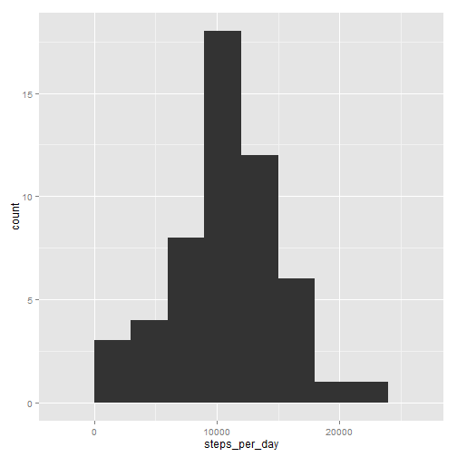

This is the R Markdown document for Peer Assessment 1.

First I need to load the .csv file with the raw data for this assignment.


```r
steps<-read.csv("D:/Tools/#Coursera/05_ReproducibleResearch/#Peer Assessments/PA1/activity.csv", na.strings = "NA")
head(steps)
```

```
##   steps       date interval
## 1    NA 2012-10-01        0
## 2    NA 2012-10-01        5
## 3    NA 2012-10-01       10
## 4    NA 2012-10-01       15
## 5    NA 2012-10-01       20
## 6    NA 2012-10-01       25
```


## What is mean total number of steps taken per day?


*1. Calculate the total number of steps taken per day*

Transforming the data in order to prepare it for the analysis and calculating the total number of steps taken each day:


```r
require(sqldf)
steps2<-sqldf("SELECT date, sum(steps) as steps_per_day FROM steps GROUP BY date")
head(steps2)
```

```
##         date steps_per_day
## 1 2012-10-01          <NA>
## 2 2012-10-02           126
## 3 2012-10-03         11352
## 4 2012-10-04         12116
## 5 2012-10-05         13294
## 6 2012-10-06         15420
```

```r
str(steps2)
```

```
## 'data.frame':	61 obs. of  2 variables:
##  $ date         : Factor w/ 61 levels "2012-10-01","2012-10-02",..: 1 2 3 4 5 6 7 8 9 10 ...
##  $ steps_per_day: chr  NA "126" "11352" "12116" ...
```

```r
steps2$steps_per_day<-as.integer(steps2$steps_per_day)
str(steps2)
```

```
## 'data.frame':	61 obs. of  2 variables:
##  $ date         : Factor w/ 61 levels "2012-10-01","2012-10-02",..: 1 2 3 4 5 6 7 8 9 10 ...
##  $ steps_per_day: int  NA 126 11352 12116 13294 15420 11015 NA 12811 9900 ...
```


*2. Make a histogram of the total number of steps taken each day*

Plotting the histogram. The binwidth chosen was 3000.


```r
require(ggplot2)
qplot(steps_per_day, data=steps2, geom="histogram", binwidth=3000)
```

 

*3. Calculate and report the mean and median of the total number of steps taken per day*

The mean of total number of steps taken per day is:


```r
mean(steps2$steps_per_day, na.rm = TRUE)
```

```
## [1] 10766.19
```

And the median of total number of steps taken per day is: 


```r
median(steps2$steps_per_day, na.rm = TRUE)
```

```
## [1] 10765
```


## What is the average daily activity pattern?


*1. The time series plot of the 5-minute interval (x-axis) and the average number of steps taken, averaged across all days (y-axis) is:*


```r
#calculating daily average per interval
steps3<-sqldf("SELECT interval, avg(steps) as steps_per_interval FROM steps GROUP BY interval")
head(steps3)
```

```
##   interval steps_per_interval
## 1        0          1.7169811
## 2        5          0.3396226
## 3       10          0.1320755
## 4       15          0.1509434
## 5       20          0.0754717
## 6       25          2.0943396
```

```r
str(steps3)
```

```
## 'data.frame':	288 obs. of  2 variables:
##  $ interval          : int  0 5 10 15 20 25 30 35 40 45 ...
##  $ steps_per_interval: num  1.717 0.3396 0.1321 0.1509 0.0755 ...
```

```r
#building the plot
ggplot(steps3, aes(x = interval, y = steps_per_interval)) + geom_line(lty = "dashed", colour = "red") + scale_x_discrete(breaks=seq(0,2400, by=100))
```

 

So, we see that there are some spikes early in the morning and on lunch time and in the evening when the work day is over.


```r
max_interval<-steps3[steps3$steps_per_interval==max(steps3$steps_per_interval),1]
```

The interval with the maximum average daily steps number is: **835**. So, the monitoring device registers the highest number of steps very early in the morning, at 8.35 AM.


## Imputing missing values

*1. Calculate and report the total number of missing values in the dataset (i.e. the total number of rows with NAs). For this I am going to use the complete.cases() function, since all the other variables have data for each of the rows and the steps variables is the only one that can have NAs.*


```r
missing_rows<-sum(as.integer(!complete.cases(steps)))
```

There is a total of **2304** rows with missing values (NAs) in the raw data file.

*2. Devise a strategy for filling in all of the missing values in the dataset. The strategy does not need to be sophisticated. For example, you could use the mean/median for that day, or the mean for that 5-minute interval, etc.*

I am going to use the mean per 5 minute interval to replace the missing values:


```r
steps4<-sqldf(
  "
  SELECT 
  CASE WHEN main.steps IS NULL THEN main.steps_per_interval ELSE main.steps END AS steps
  , main.date AS date
  , main.interval AS interval
  , main.steps_per_interval AS steps_per_interval
  FROM
  ( 
    SELECT a.*, c.steps_per_interval
    FROM steps a
    LEFT JOIN steps2 b ON a.date=b.date
    LEFT JOIN steps3 c ON a.interval=c.interval
  ) main
  "
  )
head(steps4)
```

```
##   steps       date interval steps_per_interval
## 1     1 2012-10-01        0          1.7169811
## 2     0 2012-10-01        5          0.3396226
## 3     0 2012-10-01       10          0.1320755
## 4     0 2012-10-01       15          0.1509434
## 5     0 2012-10-01       20          0.0754717
## 6     2 2012-10-01       25          2.0943396
```

Count again for incomplete cases:


```r
missing_rows<-sum(as.integer(!complete.cases(steps4)))
```

After replacing the missing values there is a total of **0** rows with missing values (NAs) left in the data frame.

*3. Create a new dataset that is equal to the original dataset but with the missing data filled in.*

From the data frame that I created in the previous step I am just going to remove the steps_per_interval variable and print the structure of the table afterwards.


```r
steps4$steps_per_interval<-NULL
str(steps4)
```

```
## 'data.frame':	17568 obs. of  3 variables:
##  $ steps   : int  1 0 0 0 0 2 0 0 0 1 ...
##  $ date    : Factor w/ 61 levels "2012-10-01","2012-10-02",..: 1 1 1 1 1 1 1 1 1 1 ...
##  $ interval: int  0 5 10 15 20 25 30 35 40 45 ...
```


*4. Make a histogram of the total number of steps taken each day and Calculate and report the mean and median total number of steps taken per day. Do these values differ from the estimates from the first part of the assignment? What is the impact of imputing missing data on the estimates of the total daily number of steps?*


```r
require(sqldf)
steps5<-sqldf("SELECT date, sum(steps) as steps_per_day FROM steps4 GROUP BY date")
steps5$steps_per_day<-as.integer(steps5$steps_per_day)
require(ggplot2)
qplot(steps_per_day, data=steps5, geom="histogram", binwidth=3000)
```

 

The histogram differs from the very first one that we built.


```r
mean2<-as.integer(mean(steps5$steps_per_day, na.rm = TRUE))
median2<-median(steps5$steps_per_day, na.rm = TRUE)
#first mean and median computed
mean1<-as.integer(mean(steps2$steps_per_day, na.rm = TRUE))
median1<-median(steps2$steps_per_day, na.rm = TRUE)
```


The mean of the total number of steps taken per day is **10749** and the median is **10641**. These two differ from the first mean and median we computed (mean = 10766 and median = 10765). In the second computation the values are a little bit smaller, taking into consideration that in the first one we ommitted the rows with NAs.


## Are there differences in activity patterns between weekdays and weekends?


*1. Create a new factor variable in the dataset with two levels - "weekday" and "weekend" indicating whether a given date is a weekday or weekend day.*


```r
steps4$weekdays_name<-weekdays(as.Date(steps4$date))
steps6<-sqldf(
  "
  SELECT day_type, interval, AVG(steps) AS avg_steps
  FROM
  (
  SELECT a.*
  , CASE WHEN weekdays_name IN ('Saturday', 'Sunday') THEN 'weekend' ELSE 'weekday' END AS day_type 
  FROM steps4 a
  ) main
  GROUP BY 1,2
  "
)
head(steps6)
```

```
##   day_type interval  avg_steps
## 1  weekday        0 2.15555556
## 2  weekday        5 0.40000000
## 3  weekday       10 0.15555556
## 4  weekday       15 0.17777778
## 5  weekday       20 0.08888889
## 6  weekday       25 1.57777778
```

```r
str(steps6)
```

```
## 'data.frame':	576 obs. of  3 variables:
##  $ day_type : chr  "weekday" "weekday" "weekday" "weekday" ...
##  $ interval : int  0 5 10 15 20 25 30 35 40 45 ...
##  $ avg_steps: num  2.1556 0.4 0.1556 0.1778 0.0889 ...
```

```r
steps6$day_type<-as.factor(steps6$day_type)
str(steps6)
```

```
## 'data.frame':	576 obs. of  3 variables:
##  $ day_type : Factor w/ 2 levels "weekday","weekend": 1 1 1 1 1 1 1 1 1 1 ...
##  $ interval : int  0 5 10 15 20 25 30 35 40 45 ...
##  $ avg_steps: num  2.1556 0.4 0.1556 0.1778 0.0889 ...
```

*2. Make a panel plot containing a time series plot (i.e. type = "l") of the 5-minute interval (x-axis) and the average number of steps taken, averaged across all weekday days or weekend days (y-axis). See the README file in the GitHub repository to see an example of what this plot should look like using simulated data.*


```r
ggplot(steps6, aes(interval,avg_steps))+geom_line(lty = "dashed", colour = "red")+facet_grid(day_type~.) + 
  ylab ("Number of steps") + xlab ("Interval") + scale_x_discrete(breaks=seq(0,2400, by=100)) 
```

 

The above panel plot shows us that there are differences between the number of steps reported by the monitoring device during the weekdays and the weekend -- our subject wakes up earlier in the morning during the weekdays and has a more sedentary activity during the working hours as opposed to the weekends when he wakes up a little bit later than during the working days and he is more active during the majority of the day.

